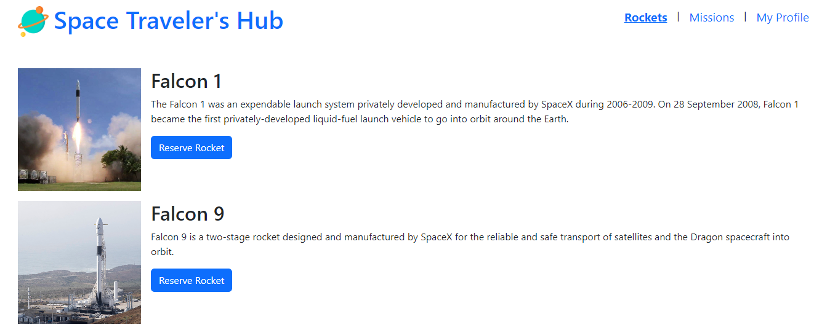

<a name="readme-top"></a>

<div align="center">
    
  <br/>

<h3><b>Space Traveler's Hub </b></h3>

<!-- TABLE OF CONTENTS -->

# 📗 Table of Contents<a name="table-contents"></a>

- [📖 About the Project](#about-project)
  - [🛠 Built With](#built-with)
    - [Tech Stack](#tech-stack)
    - [Key Features](#key-features)
  - [🚀 Live Demo](#live-demo)
- [💻 Getting Started](#getting-started)
  - [Setup](#setup)
  - [Prerequisites](#prerequisites)
  - [Install](#install)
  - [Usage](#usage)
- [👥 Authors](#authors)
- [🔭 Future Features](#future-features)
- [🤝 Contributing](#contributing)
- [⭐️ Show your support](#support)
- [🙏 Acknowledgements](#acknowledgements)
- [📝 License](#license)

<!-- PROJECT DESCRIPTION -->

# 📖 About <a name="about-project"></a>

A single page web application that provides a platform for scientists to get booked for reservations and join missions to space travel.
# 📖 [Space Traveler's Hub] <a name="about-project"></a>

> **Space Traveler's Hub** is a web application for a company that provides commercial and scientific space travel services. The application will allow users to book rockets and join selected space missions. The Space Travelers' Hub consists of Rockets, Missions, and the My Profile section. 
> - **Rockets /Dragons Section** - this section displays a list of all available SpaceX rockets. Users can book each rocket by clicking the reservation button or cancel the previously made booking. The same layout is used to form the Dragons section [added only if your team has 3 members].
> - **Missions Section** - this section displays a list of current missions along with their brief description and participation status. There is also a button next to each mission that allows users to join the selected mission or leave the mission the user joined earlier.
> - **My Profile Section** - The My Profile section displays all reserved rockets and space missions.

Building this application will allow to learn how to use React and Redux in the context of a real application and get hand exprience on front-end development.

## 🛠 Built With <a name="built-with"></a> 

### Tech Stack <a name="tech-stack"></a>
> - [ReactJS](https://react.dev)
> - [Redux](https://react-redux.js.org)
> - [React-Boostrap](https://react-bootstrap.github.io/)
> - [Jest Test]()
> - [React Testing Library](https://testing-library.com/)

### Database <a name="data-base"></a>
- API dependdencies

<details>
  <summary>Client</summary>
  <ul>
    <li><a href="#">NA</a></li>
  </ul>
</details>

<details>
  <summary>Server</summary>
  <ul>
    <li><a href="#">N/A</a></li>
  </ul>
</details>

<details>
<summary>Database</summary>
  <ul>
    <li><a href="#">N/A</a></li>
  </ul>
</details>

<!-- Features -->

### Key Feature <a name="key-features"></a>
 - Fetching External API
 - Joining and Leaving Missions to space 
 - Rocket Booking and Canceling reservation

<p align="right">(<a href="#table-contents">back to top</a>)</p>

<!-- LIVE DEMO -->
## 🚀 Live Demo <a name="live-demo"></a> 
 Coming soon

<!-- [Space Traveler's Hub]() -->

<p align="right">(<a href="#table-contents">back to top</a>)</p>

<!-- GETTING STARTED -->

## 💻 Getting Started <a name="getting-started"></a>

To get the content of this project locally you need to run the following commands in your terminal.

### Prerequisites

- IDE (code editor) like: VScode, Sublime, etc
- [Git](https://www.linode.com/docs/guides/how-to-install-git-on-linux-mac-and-windows/)


### Setup

1. Download the **Zip** file or clone the repo with:
```bash
git clone https://github.com/ZewdieMc/space-traveler
```
2. To access cloned directory run:
```bash
cd space-traveler
```

### Install

> To install linters and other project's dependencies run:

```bash
npm install
```

### Usage

To run the project, execute the following command: 

- Excute below command in the terminal to serve live 
```bash
npm run dev
```

## Run Test for Linters

For tracking linter errors locally you need to follow these steps:

1. For tracking linter errors in HTML files run:
```bash 
npx hint .
```

2. For tracking linter errors in CSS or SASS files run:

```bash
npx stylelint "\*_/_.{css,scss}"
```

3. For tracking linter errors in JavaScript files run:

```bash
npx eslint .
```

<!-- ### Deployment -->

<!-- [Space Traveler's Hub]() -->

<p align="right">(<a href="#table-contents">back to top</a>)</p>

<!-- AUTHOR -->

## 👥 Author: <a name="authors"></a>

👤 **Authors**

Chere Lemma
- GitHub: [Zewdie Habtie](https://github.com/ZewdieMc)
- Twitter: [Zewdie Habte](https://twitter.com/HabtieZewdie)

Zewdie Habtie
- GitHub: [Chere Lemma](https://github.com/cherelemma)
- Twitter: [Chere Lemma](https://twitter.com/Chere21271613)

<p align="right">(<a href="#table-contents">back to top</a>)</p>

<!-- FUTURE FEATURES -->

## 🔭 Future Features <a name="future-features"></a>

- Mobile version resposiveness.
- Implement leave mission and cancel rocket reservation functionality in My Profile.
- Implement Dragon components and add featurers

<p align="right">(<a href="#table-contents">back to top</a>)</p>

<!-- CONTRIBUTING -->

## 🤝 Contributing <a name="contributing"></a>

Contributions, issues, and feature requests are welcome!

[Kindly raise issue here](https://github.com/ZewdieMc/space-traveler/issues)

<p align="right">(<a href="#table-contents">back to top</a>)</p>

<!-- SUPPORT -->

## ⭐️ Show your support <a name="support"></a>

If you like this project, kindly follow me on GitHub 😊

<p align="right">(<a href="#table-contents">back to top</a>)</p>

<!-- ACKNOWLEDGEMENTS -->

## 🙏 Acknowledgments <a name="acknowledgements"></a>

Much appreciation goes to microverse and Space X for the availability of the API to practice.

<p align="right">(<a href="#table-contents">back to top</a>)</p>

<!-- LICENSE -->

## 📝 License <a name="license"></a>

This project is [MIT](./LICENSE) licensed.

<p align="right">(<a href="#table-contents">back to top</a>)</p>
